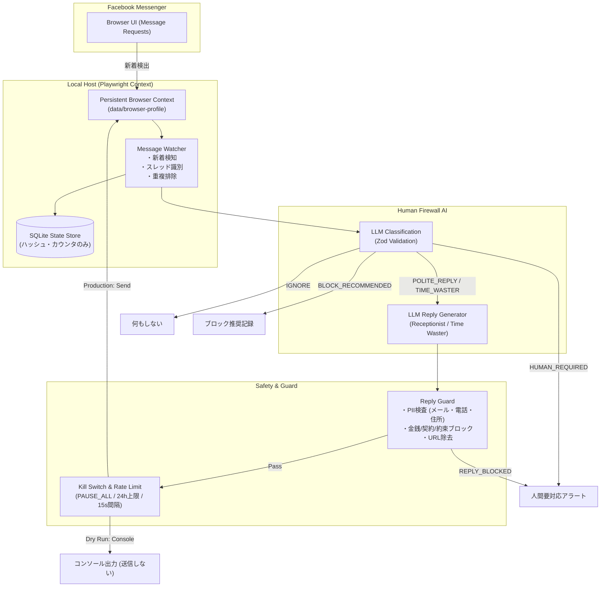

# Messenger Human Firewall

個人Facebook Messenger向けのローカル常駐型 **「Messenger Human Firewall」**。

Facebook Messengerに届く「友人ではない／知らない相手からのメッセージリクエスト」をローカルPC上で安全に検知し、LLMを介して安全に自動応答・無力化するセキュリティ＆自動化基盤です。

---

## 目的

見知らぬ相手やスパム・詐欺メッセージに対して、**「本人の個人情報や意思を一切出さず」**、かつ**「安全な防壁（Firewall）」**として介在します。

AIは所有者本人を演じるのではなく、**自動応答アシスタント（Human Firewall）**として機能します。

```text
Internet Stranger ────▶ AI Firewall (Human Firewall) ────▶ 必要な場合のみ人間へエスカレーション
```

---

## 実装ステータス (Implementation Status)

| Phase | 内容 | 状態 | 備考 |
| :--- | :--- | :--- | :--- |
| **Phase 1** | **Skeleton & Safety Foundations** | **完了 (Completed)** | 型定義、Reply Guard、Kill Switch、厳格セレクタ、CI |
| **Phase 2** | **Browser Watcher** | **完了 (Completed)** | Playwright監視、Message Requests/未読検知、SQLite重複排除、Fake HTMLテスト |
| **Phase 3** | **Human Firewall AI** | **完了 (Completed)** | Gemini 3.6 Flash 分類・返信生成、Structured Output、Reply Guard統合 |
| **Phase 4** | **Dry Run Integration** | **完了 (Completed)** | 全パイプライン統合 (DRY_RUN=true)、10シナリオテスト検証、ユーザー確認要求 |
| **Phase 5** | **Controlled Reply** | **完了 (Completed)** | 指定スレッド限定送信、最大3通制限、自動停止、Playwright入力・送信 |
| **Phase 6** | **Time Waster State Machine** | **完了 (Completed)** | ターン数（1〜3）に応じた状態遷移（Curious ➜ Deep Probing ➜ Hesitant Closing） |
| **Phase 7** | **Local Dashboard** | **完了 (Completed)** | `npm run dashboard` (`http://localhost:3000`) 管理画面・Kill Switch切替・スレッド一覧・手動ポーズ |

> [!NOTE]
> 現在のリポジトリは **全フェーズ（Phase 1 〜 Phase 7）完了** 段階です。ゼロからの安全設計、Playwright ブラウザ監視、Gemini 3.6 Flash 分類・返信生成、Reply Guard セキュリティ防壁、Dry Run 検証、Controlled Reply 制限送信、Time Waster ステートマシン、およびローカルダッシュボード Web UI までの一貫した基盤が完成しています。全58テスト通過・型検査・Lint正常。


---

## 動作モード

### 1. AI Receptionist
- **対象**: 通常の見知らぬ相手（NORMAL）
- **方針**: 愛想よく短く応答（1〜2文）
- **特徴**: 本人の意見や個人情報は絶対に語らず、用件やきっかけを丁寧に尋ねる。

### 2. AI Time Waster
- **対象**: 詐欺、怪しい投資・暗号資産、副業勧誘、スパム、営業
- **方針**: 相手の要求に応じず、個人情報を渡さず、愛想よく質問を返して時間を浪費させる。
- **特徴**: 
  - 相槌 ➜ 曖昧な質問 ➜ 説明を求める ➜ さらなる詳細を聞く
  - 外部リンクは絶対に開かない
  - ファイルはダウンロードしない
  - 金銭・契約・面会の約束は一切しない
  - 罵倒せず、常に `friendly / confused / curious / non-committal` を維持

---

## Target Architecture



---

## Safety Model & Security

1. **ゼロ・ナレッジ**: LLMに所有者の個人情報（住所、電話番号、勤務先等）を一切渡さない。
2. **Untrusted Input**: 相手からのメッセージはすべて未信頼の外部入力として扱い、Prompt Injectionを無力化。
3. **二重防御 (Reply Guard)**: LLMが万一危険な返信（合意、個人情報、URL等）を生成しても送信直前で遮断。
4. **機密完全除外**: `.env`, Cookie, Facebook Session, ブラウザプロファイルはリポジトリに一切コミットしない。
5. **暴走防止**: 1スレッドあたり1日最大20返信、最小15秒の送信間隔、緊急停止キルスイッチ。
6. **本文非保存**: メッセージ本文をDBに平文保存せず、ログにも本文を出力しない（ハッシュとメタデータのみ記録）。

詳細な脅威分析は [THREAT_MODEL.md](docs/THREAT_MODEL.md) を参照してください。

---

## セットアップ

### 必要要件
- Node.js 20+
- npm 9+
- Google Chrome または Playwright Chromium

### インストール

```bash
# 依存関係のインストール
npm install

# 環境変数の設定
cp .env.example .env
```

`.env` に必要な項目を設定します：
- `GEMINI_API_KEY`: Google Gemini API Key
- `DRY_RUN=true`: 初期検証時は必ず `true` に設定

---

## 使い方

### 1. 手動ログイン (初回のみ)
Playwright Persistent Context 用の Chrome を起動し、Messenger に手動ログインしてセッションを保存します。

```bash
npm run login
```
ログイン完了後、開いたブラウザウィンドウを閉じるとセッションが `data/browser-profile` に保存されます。

### 2. Message Requests 監視スキャン (Dry Run)
保存されたセッションを用いて Messenger の「メッセージリクエスト」を監視スキャンします。未読メッセージを検知して適格性を判定しますが、**Messengerへの自動送信は行われません**。

```bash
npm run dev
```

### 2. 緊急停止 (Kill Switch)

```bash
# システムの即時停止 (返信と監視をブロック)
npm run pause

# 再開
npm run resume

# 現在のステータス確認
npm run status
```

`.env` で `PAUSE_ALL=true` を設定することでも即時停止可能です。

### 3. テストの実行

```bash
# 単体テストの実行
npm test

# 型チェックおよびビルド
npm run build

# リンター
npm run lint
```

---

## ログ設計 (Observability)

本システムはプライバシー保護のため、メッセージ本文を標準出力やログにダンプしません。以下の構造化イベントのみを出力します：

- `THREAD_DETECTED`
- `MESSAGE_RECEIVED`
- `CLASSIFIED`
- `REPLY_GENERATED`
- `REPLY_BLOCKED`
- `REPLY_SENT`
- `RATE_LIMITED`
- `HUMAN_REQUIRED`
- `LOGIN_REQUIRED`
- `ERROR`

ログ出力例：
```json
{"timestamp":"2026-09-17T02:50:00.000Z","event":"CLASSIFIED","threadHash":"sha256:abc...","category":"SCAM","action":"TIME_WASTER","risk":85}
```

---

## 既知の制限事項 (Known Limitations)

- Facebook MessengerのDOM構造の変更により、定期的なセレクタのメンテナンスが必要になる場合があります。
- CAPTCHAや多要素認証（MFA）を自動で迂回することはポリシー上サポートしません。初回ログインは手動ブラウザで行います。
- 本ツールは受信メッセージに対する防御目的であり、能動的な新規メッセージ送信機能は持っていません。
