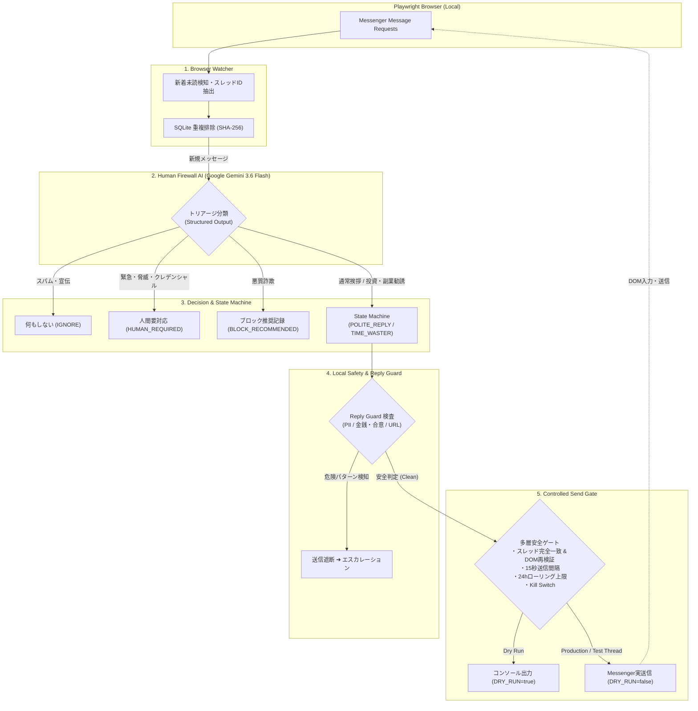

# Messenger Human Firewall

個人Facebook Messenger向けのローカル常駐型 **「Messenger Human Firewall」**。

Facebook Messengerに届く「友人ではない／知らない相手からのメッセージリクエスト」をローカルPC上で安全に検知し、LLMを介して安全に自動応答・無力化するセキュリティ＆自動化基盤です。

---

## 目的

見知らぬ相手やスパム・詐欺メッセージに対して、**「本人の個人情報や意思を一切出さず」**、かつ**「安全な防壁（Firewall）」**として介在します。

AIは所有者本人を演じるのではなく、**自動応答アシスタント（Human Firewall）**として機能します。

```text
Internet Stranger ────▶ AI Firewall (Human Firewall) ────▶ 必要な場合のみ人間へエスカレーション
```

### なぜ一律ブロックしないのか？ (Why not just block?)
「見知らぬ相手からのメッセージを一律ブロックすればよいのでは？」という疑問が生じるかもしれません。  
しかし、SNS上の見知らぬ相手には、**新規ビジネスの問い合わせ、取材依頼、旧友からの久しぶりの連絡**など、見落とすべきではない正当なコンタクトが含まれます。  

本プロジェクトは単なるスパムブロッカーではなく、**「有益な連絡は丁寧に受付（AI Receptionist）しつつ、悪質な詐欺や営業勧誘には愛想よく質問を返して時間を浪費させ無力化する（AI Time Waster）」** という、AIを活用したプロアクティブな「多層防御（Defense-in-Depth）人間防壁」の技術検証リポジトリです。

---

## 処理パイプライン (Target Architecture)

<p align="center">
  
</p>

### フローチャート (Pipeline Flowchart)



---

## 実装ステータス (Implementation Status)

> [!WARNING]
> **Status: Experimental / v0**
> 本プロジェクトは **Meta の公式 API を利用するものではなく、Web UI を Playwright で操作する実験的なリサーチ・防御プロトタイプ** です。
> 個人アカウントでの利用にあたっては、必ず `DRY_RUN=true` で挙動確認を行い、Meta利用規約およびレートリミットを遵守してください。商用環境での無人運用は推奨されません。

| Phase | 内容 | 状態 | 備考 |
| :--- | :--- | :--- | :--- |
| **Phase 1** | **Skeleton & Safety Foundations** | **完了 (Completed)** | 型定義、Reply Guard、Kill Switch、厳格セレクタ、CI |
| **Phase 2** | **Browser Watcher** | **完了 (Completed)** | Playwright監視、Message Requests/未読検知、SQLite重複排除、Fake HTMLテスト |
| **Phase 3** | **Human Firewall AI** | **完了 (Completed)** | Gemini 3.6 Flash 分類・返信生成、Structured Output、Reply Guard統合 |
| **Phase 4** | **Dry Run Integration** | **完了 (Completed)** | 全パイプライン統合 (DRY_RUN=true)、10シナリオテスト検証、ユーザー確認要求 |
| **Phase 5** | **Controlled Reply** | **完了 (Completed)** | 指定スレッド限定送信、最大3通制限、自動停止、Playwright入力・送信 |
| **Phase 6** | **Time Waster State Machine** | **完了 (Completed)** | ターン数（1〜3）に応じた状態遷移（Curious ➜ Deep Probing ➜ Hesitant Closing） |
| **Phase 7** | **Local Dashboard** | **完了 (Completed)** | `npm run dashboard` (`http://localhost:3000`) 管理画面・Kill Switch切替・スレッド一覧・手動ポーズ |

---

## 信頼境界とデータポリシー (Trust Boundary & Data Policy)
 
詳細なシステムトポロジおよびコンポーネント構成は [ARCHITECTURE.md](docs/ARCHITECTURE.md) を参照してください。
 
### データ送信とプライバシーに関する重要事項
1. **外部送信対象**: トリアージおよび返信生成のため、受信した相手のメッセージ本文のみが HTTPS 経由で Google Gemini API に送信されます。
2. **所有者情報の保護**: LLM に対し、ユーザー自身の個人情報（氏名、電話番号、住所、スケジュール等）はプロンプトに一切与えません（Zero-Context Prompting）。
3. **ローカル永続化**: ローカル DB（SQLite）および標準出力ログにはメッセージ本文を平文で保存せず、SHA-256 ハッシュと安全なメタデータのみを記録します。
4. **コンソール非表示**: 送信候補テキストおよびLLMの判定理由はデフォルトでマスク表示されます（内容を点検する場合は `DEBUG=true` を指定）。
5. **利用規約・データ保護**: ご利用の Google Cloud / Gemini API アカウントにおけるデータ保持・学習ポリシー（有料 Tier でのオプトアウト等）を事前にご確認ください。

---

## 動作モード

### 1. AI Receptionist
- **対象**: 通常の見知らぬ相手（NORMAL）
- **方針**: 愛想よく短く応答（1〜2文）
- **特徴**: 本人の意見や個人情報は絶対に語らず、用件やきっかけを丁寧に尋ねる。

### 2. AI Time Waster
- **対象**: 詐欺、怪しい投資・暗号資産、副業勧誘、スパム、営業
- **方針**: 相手の要求に応じず、個人情報を渡さず、愛想よく質問を返して時間を浪費させる。
- **特徴**: 
  - 相槌 ➜ 曖昧な質問 ➜ 説明を求める ➜ さらなる詳細を聞く
  - 外部リンクは絶対に開かない
  - ファイルはダウンロードしない
  - 金銭・契約・面会の約束は一切しない
  - 罵倒せず、常に `friendly / confused / curious / non-committal` を維持

---

## 多層防御アーキテクチャ (Defense-in-Depth)

1. **Zero-Context Prompting**: LLMに所有者の個人情報（住所、電話番号、勤務先等）を渡さないコンテキスト設計。
2. **Untrusted Input 原則**: 相手からのメッセージは未信頼の外部入力として扱い、システムプロンプトの強固なガードレールでPrompt Injectionを抑制。
3. **ローカル二重検査 (Reply Guard)**: LLMの出力結果を送信直前にローカルの正規表現・ルールベースで検査し、個人情報・URL・合意フレーズをブロック。
4. **機密完全除外**: `.env`, Cookie, Facebook Session, ブラウザプロファイルはリポジトリから除外（`.gitignore`）。
5. **多層レートリミット & コスト防護**:
   - 誤スレッド送信の二重検証（クリック後にアクティブスレッドを再検証）
   - 1スレッド最大3返信制限（初期制限）
   - 24時間ローリング送信上限（最大20返信/スレッド）
   - 1日のLLM総リクエスト上限（`MAX_LLM_REQUESTS_PER_DAY` デフォルト100回）
   - 15秒送信インターバル待機
   - 緊急停止キルスイッチ
6. **ログ・DB ハッシュ化**: メッセージ本文をDBに平文保存せず、ログにもサニタイズされた定型コード（`reasonCode`）とハッシュのみ記録。

詳細な脅威分析は [THREAT_MODEL.md](docs/THREAT_MODEL.md) を参照してください。

---

## セットアップ

### 必要要件
- Node.js 20+
- npm 9+
- Google Chrome または Playwright Chromium

### インストール

```bash
# 依存関係のインストール
npm install

# 環境変数の設定
cp .env.example .env
```

`.env` に必要な項目を設定します：
- `GEMINI_API_KEY`: Google Gemini API Key
- `DRY_RUN=true`: 初期検証時は必ず `true` に設定

---

## 使い方

### 1. 手動ログイン (初回のみ)
Playwright Persistent Context 用の Chrome を起動し、Messenger に手動ログインしてセッションを保存します。

```bash
npm run login
```
ログイン完了後、開いたブラウザウィンドウを閉じるとセッションが `data/browser-profile` に保存されます。

### 2. Message Requests 監視スキャン (Dry Run)
保存されたセッションを用いて Messenger の「メッセージリクエスト」を監視スキャンします。未読メッセージを検知して適格性を判定しますが、**Messengerへの自動送信は行われません**。

```bash
npm run dev

# 候補文や判定理由をコンソール上で点検したい場合
DEBUG=true npm run dev
```

### 3. 緊急停止 (Kill Switch)

```bash
# システムの即時停止 (返信と監視をブロック)
npm run pause

# 再開
npm run resume

# 現在のステータス確認
npm run status
```

`.env` で `PAUSE_ALL=true` を設定することでも即時停止可能です。

### 4. ローカルダッシュボード (Web UI)
ブラウザ上でリアルタイムにシステム状態の確認、Kill Switch の切替、スレッド一覧の閲覧、スレッド単位の手動停止が可能です。

```bash
npm run dashboard
# ブラウザで http://localhost:3000 にアクセス
```

### 5. テストの実行

```bash
# 単体・結合テストの実行
npm test

# 型チェックおよびビルド
npm run build

# リンター
npm run lint
```

---

## ログ設計 (Observability)

本システムはプライバシー保護のため、メッセージ本文やLLMの思考テキストを標準出力やログにダンプしません。以下の構造化イベントおよび機械可読コードのみを出力します：

- `THREAD_DETECTED`
- `MESSAGE_RECEIVED`
- `CLASSIFIED`
- `REPLY_GENERATED`
- `REPLY_BLOCKED`
- `REPLY_SENT`
- `RATE_LIMITED`
- `HUMAN_REQUIRED`
- `LOGIN_REQUIRED`
- `ERROR`

ログ出力例：
```json
{"timestamp":"2026-09-17T02:50:00.000Z","event":"CLASSIFIED","threadHash":"sha256:abc...","category":"SCAM","action":"TIME_WASTER","risk":85,"reasonCode":"SCAM_CLASSIFIED"}
```

---

## 既知の制限事項 (Known Limitations)

- Facebook MessengerのDOM構造の変更により、定期的なセレクタのメンテナンスが必要になる場合があります。
- CAPTCHAや多要素認証（MFA）を自動で迂回することはポリシー上サポートしません。初回ログインは手動ブラウザで行います。
- 本ツールは受信メッセージに対する防御目的であり、能動的な新規メッセージ送信機能は持っていません。

---

## スコープ外の項目 (Non-Goals)

本プロジェクトでは、安全性およびプライバシー保護の観点から以下の機能を明示的にスコープ外（Non-goals）としています：

- **友人・既存連絡先への自動返信**: 通常受信トレイの既知のスレッドには一切干渉しません（メッセージリクエストのみを対象）。
- **CAPTCHA・MFA・ボット検知の回避**: Metaのセキュリティ機構を迂回する機能は実装しません。ログインや二要素認証はユーザー本人が手動ブラウザで行います。
- **能動的な新規DM送信・営業自動化**: 相手から受信したメッセージへの防壁・応答に限定し、自分から新規スレッドを開始する営業・送信機能は提供しません。
- **本人になりすました合意・意思決定**: 所有者の意見代弁、契約締結、面会受諾、金銭授受の約束は行いません。

---

## ロードマップ (Roadmap)

- [x] **v0 (Current)**: Message Requests 検知、Gemini 3.6 Flash トリアージ、Reply Guard による PII/合意/URL 遮断、Controlled Reply、ローカル Web ダッシュボード。
- [ ] **v1 (Planned)**:
  - 複数 LLM プロバイダ対応（ローカル Ollama / Claude / OpenAI の抽象化切り替え）。
  - Slack / Webhook 経由の `HUMAN_REQUIRED` 即時モバイル通知連携。
  - セレクタ自己修復 / ヘルスチェック機能（DOM 変更の早期自動検知）。

---

## ライセンス & パッケージ設計 (License & Design)

- **ライセンス**: [MIT License](LICENSE)
- **パッケージ設計**: 本プロジェクトはローカル常駐のCLI／デーモンアプリケーションであり、再利用可能なnpmライブラリパッケージではありません。意図しない npm レジストリへの誤公開（Accidental npm publish）を未然に防止するため、`package.json` には明示的に `"private": true` を設定しています。
