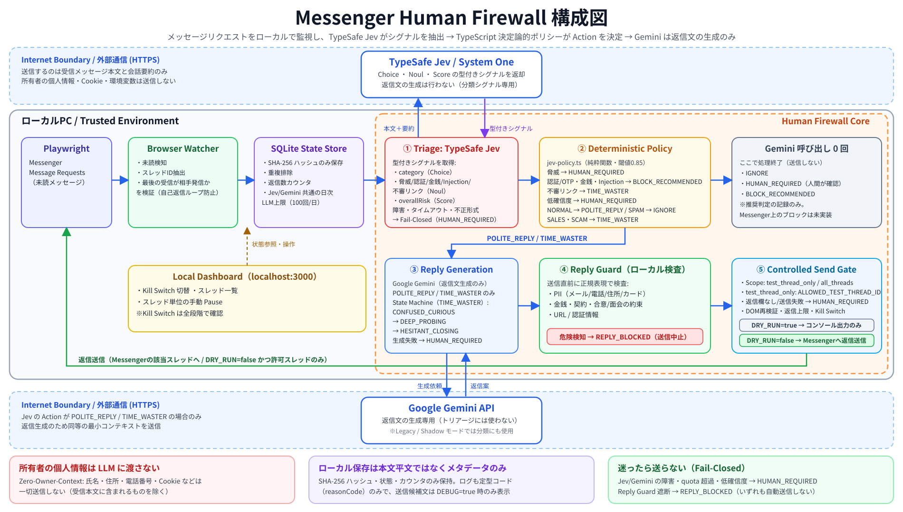
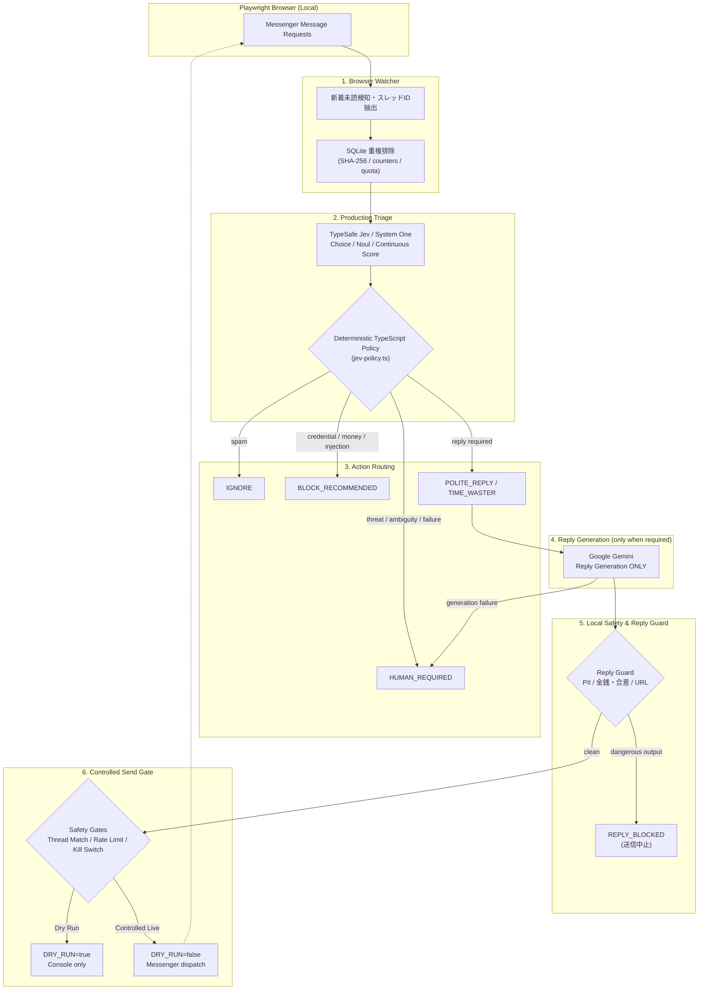

# Messenger Human Firewall

個人Facebook Messenger向けのローカル常駐型 **「Messenger Human Firewall」**。

Facebook Messengerに届く「友人ではない／知らない相手からのメッセージリクエスト」をローカルPC上で安全に検知し、AIとローカルの決定論的ルールを組み合わせて、安全にトリアージ・応答し、危険なメッセージは人間の確認へ回す（`BLOCK_RECOMMENDED` / `HUMAN_REQUIRED`）セキュリティ＆自動化基盤です。なお `BLOCK_RECOMMENDED` は推奨判定を記録するだけで、Messenger 上で実際にブロックする処理は行いません。

現在の本番構成では、**TypeSafe Jev / System One が受信メッセージから型付きセキュリティシグナルを抽出し、TypeScript の決定論的ポリシーが最終Actionを決定**します。**Google Geminiは返信が必要な場合の文章生成専用**で、トリアージ判断には使用しません。

| 役割 | コンポーネント |
| :--- | :--- |
| セマンティック・トリアージ | TypeSafe Jev / System One |
| 最終Action決定 | Deterministic TypeScript Policy |
| 返信文生成 | Google Gemini（`POLITE_REPLY` / `TIME_WASTER` のみ） |
| 送信直前検査 | Local Reply Guard |
| 実送信制御 | Controlled Send Gate / DRY_RUN / Kill Switch |

---

## 目的

見知らぬ相手やスパム・詐欺メッセージに対して、**「本人の個人情報や意思を一切出さず」**、かつ**「安全な防壁（Firewall）」**として介在します。

AIは所有者本人を演じるのではなく、**自動応答アシスタント（Human Firewall）**として機能します。

```text
Internet Stranger ────▶ AI Firewall (Human Firewall) ────▶ 必要な場合のみ人間へエスカレーション
```

### なぜ一律ブロックしないのか？ (Why not just block?)
「見知らぬ相手からのメッセージを一律ブロックすればよいのでは？」という疑問が生じるかもしれません。  
しかし、SNS上の見知らぬ相手には、**新規ビジネスの問い合わせ、取材依頼、旧友からの久しぶりの連絡**など、見落とすべきではない正当なコンタクトが含まれます。  

本プロジェクトは単なるスパムブロッカーではなく、**「有益な連絡は丁寧に受付（AI Receptionist）しつつ、悪質な詐欺や営業勧誘には愛想よく質問を返して時間を浪費させ無力化する（AI Time Waster）」** という、AIを活用したプロアクティブな「多層防御（Defense-in-Depth）人間防壁」の技術検証リポジトリです。

---

## 処理パイプライン (Current Architecture)

<p align="center">
  
</p>

### フローチャート (Pipeline Flowchart)



**重要:** Active Jev Modeでは `IGNORE` / `HUMAN_REQUIRED` / `BLOCK_RECOMMENDED` の判定後にGemini APIを呼びません。Jev・GeminiのAPI障害、日次API quota超過、返信生成失敗はすべて安全側へFail-Closedします。

---

## 実装ステータス (Implementation Status)

> [!WARNING]
> **Status: Experimental / v0**
> 本プロジェクトは **Meta の公式 API を利用するものではなく、Web UI を Playwright で操作する実験的なリサーチ・防御プロトタイプ** です。
> 個人アカウントでの利用にあたっては、必ず `DRY_RUN=true` で挙動確認を行い、Meta利用規約およびレートリミットを遵守してください。商用環境での無人運用は推奨されません。

| Phase | 内容 | 状態 | 備考 |
| :--- | :--- | :--- | :--- |
| **Phase 1** | **Skeleton & Safety Foundations** | **完了 (Completed)** | 型定義、Reply Guard、Kill Switch、厳格セレクタ、CI |
| **Phase 2** | **Browser Watcher** | **完了 (Completed)** | Playwright監視、Message Requests/未読検知、SQLite重複排除、Fake HTMLテスト |
| **Phase 3** | **Initial Human Firewall AI** | **完了 (Completed)** | Geminiベースの初期分類・返信生成、Structured Output、Reply Guard統合 |
| **Phase 4** | **Dry Run Integration** | **完了 (Completed)** | 全パイプライン統合 (`DRY_RUN=true`)、シナリオテスト |
| **Phase 5** | **Controlled Reply** | **完了 (Completed)** | 指定スレッド限定送信、返信上限、自動停止、Playwright入力・送信 |
| **Phase 6** | **Time Waster State Machine** | **完了 (Completed)** | Curious ➜ Deep Probing ➜ Hesitant Closing の状態遷移 |
| **Phase 7** | **Local Dashboard** | **完了 (Completed)** | 管理画面、Kill Switch切替、スレッド一覧・手動ポーズ |
| **Phase 8** | **Jev Production Triage** | **完了 (Completed)** | Jevを本番トリアージへ昇格、TypeScript deterministic policy、Geminiを返信生成専用化、Fail-Closed / Shadow / Legacy互換 |
| **Phase 9** | **Operational Hardening** | **完了 (Completed)** | Jev/Gemini共通API quota、重複Gemini呼び出し抑止（Active Mode。Legacy/Shadow では `TIME_WASTER` 時に分類＋返信生成で Gemini を2回呼びます）、ログサニタイズ、GitHub Actions CI再現性 |

---

## 信頼境界とデータポリシー (Trust Boundary & Data Policy)
 
詳細なシステムトポロジおよびコンポーネント構成は [ARCHITECTURE.md](docs/ARCHITECTURE.md) を参照してください。
 
### データ送信とプライバシーに関する重要事項 (Data Privacy Policy)
1. **外部送信対象**: 受信メッセージ本文と会話要約フィールドはトリアージのため TypeSafe Jev へ送信されます（現状、会話要約は呼び出し側から渡されないため常に「なし」です）。JevのActionが `POLITE_REPLY` / `TIME_WASTER` の場合のみ、返信生成のため同等の最小コンテキストを Google Gemini へ送信します。Shadow / Legacy モードでは Gemini もトリアージのために本文を受け取ります。
2. **所有者情報の保護 (Zero-Owner-Context)**: ローカルの秘密鍵、セッションCookie、環境変数、および所有者自身の個人プロファイル情報（本名、住所、電話番号等）はプロンプトに一切追加・送信されません。
   > [!NOTE]
   > 受信メッセージ本文自体に送信者自身の個人情報（電話番号、氏名等）が含まれる場合、それらはトリアージ判定のために Jev / Gemini へ送信されます。
3. **ローカル永続化**: ローカル DB（SQLite）および標準出力ログにはメッセージ本文を平文で保存せず、SHA-256 ハッシュと安全なメタデータ（reasonCode 等）のみを記録します。
4. **コンソール非表示**: 送信候補テキストおよび LLM の判定理由はデフォルトでマスク表示されます（内容を点検する場合は `DEBUG=true` を指定）。
5. **利用規約・データ保護**: ご利用の Google Cloud / Gemini API および TypeSafe AI アカウントにおけるデータ保持・学習ポリシーをご確認ください。

---

## 動作モード

### 1. AI Receptionist
- **対象**: 通常の見知らぬ相手（NORMAL）
- **方針**: 愛想よく短く応答（1〜2文）
- **特徴**: 本人の意見や個人情報は絶対に語らず、用件やきっかけを丁寧に尋ねる。

### 2. AI Time Waster
- **対象**: 詐欺、怪しい投資・暗号資産、副業勧誘、営業、および不審な外部リンクを含むメッセージ（無差別のスパム広告は `IGNORE` として返信しません）
- **方針**: 相手の要求に応じず、個人情報を渡さず、愛想よく質問を返して時間を浪費させる。
- **特徴**: 
  - 相槌 ➜ 曖昧な質問 ➜ 説明を求める ➜ さらなる詳細を聞く
  - 外部リンクは絶対に開かない
  - ファイルはダウンロードしない
  - 金銭・契約・面会の約束は一切しない
  - 罵倒せず、常に `friendly / confused / curious / non-committal` を維持

---

## 多層防御アーキテクチャ (Defense-in-Depth)

1. **Zero-Owner-Context Prompting**: ローカルの秘密情報や所有者プロファイルを LLM / Jev に渡さないコンテキスト設計。
2. **Untrusted Input 原則**: 相手からのメッセージは未信頼の外部入力として扱い、システムプロンプトの強固なガードレールでPrompt Injectionを抑制。
3. **ローカル二重検査 (Reply Guard)**: LLMの出力結果を送信直前にローカルの正規表現・ルールベースで検査し、個人情報・URL・合意フレーズをブロック。
4. **機密完全除外**: `.env`, Cookie, Facebook Session, ブラウザプロファイルはリポジトリから除外（`.gitignore`）。
5. **多層レートリミット & コスト防護**:
   - 誤スレッド送信の二重検証（クリック後にアクティブスレッドを再検証）
   - デフォルトの `AUTO_REPLY_SCOPE=test_thread_only` では、実送信は `ALLOWED_TEST_THREAD_ID` に完全一致するスレッドのみ（未設定なら送信しません）
   - `AUTO_REPLY_SCOPE=all_threads` は送信許可リストを外す設定です。ただし現在の watcher は Message Requests を監視しており、実画面の未承認リクエストには返信欄がないため、**未承認リクエストへ自動返信できる設定ではありません**。送信欄がない場合は Fail-Closed で `HUMAN_REQUIRED` として処理済みに記録します
   - 1スレッド累計最大3返信制限（`CONTROLLED_MAX_REPLIES`、最大20まで設定可。到達でスレッド自動 pause）
   - 24時間ローリング送信上限（`MAX_REPLIES_PER_THREAD_PER_DAY`、デフォルト20返信/スレッド。`CONTROLLED_MAX_REPLIES` を引き上げない限り累計上限が先に効きます）
   - Jev / Gemini 共通の日次AIリクエスト上限（`MAX_LLM_REQUESTS_PER_DAY` デフォルト100回。Shadow Mode では Gemini と Jev の両方が消費します）
   - 15秒送信インターバル待機
   - 緊急停止キルスイッチ
6. **ログ・DB ハッシュ化**: メッセージ本文をDBに平文保存せず、ログにもサニタイズされた定型コード（`reasonCode`）とハッシュのみ記録。

詳細な脅威分析は [THREAT_MODEL.md](docs/THREAT_MODEL.md) を参照してください。

---

## セットアップ

### 必要要件
- Node.js 20+
- npm 9+
- Google Chrome（`npm run dev` / `npm run login` は Playwright の `channel: 'chrome'` を使用）
- TypeSafe Jev / System One API Key
- Google Gemini API Key（返信生成、および Legacy / Shadow Mode のトリアージを利用する場合）

### インストール

```bash
# 依存関係のインストール
npm install

# 環境変数の設定
cp .env.example .env
```

> [!NOTE]
> `@typesafe-ai/sdk` はレジストリからは取得できないため、`typesafe-ai-sdk-0.6.0.tgz` をリポジトリに同梱し、`package.json` / `package-lock.json` の両方で `file:typesafe-ai-sdk-0.6.0.tgz` として固定しています。通常は上記の `npm install` / CIの `npm ci` だけで追加作業は不要です。

`.env` に必要な項目を設定します：
- `TYPESAFE_API_KEY`: TypeSafe Jev API Key（本番トリアージ用）
- `GEMINI_API_KEY`: Google Gemini API Key（Active Jev Mode では返信文生成用。Legacy / Shadow Mode ではトリアージにも使用）
- `DRY_RUN=true`: 初期検証時は必ず `true` に設定
- `AUTO_REPLY_SCOPE`: 返信対象スレッドのスコープ（`test_thread_only` または `all_threads`。デフォルトは `test_thread_only`）
- `ALLOWED_TEST_THREAD_ID`: `DRY_RUN=false` かつ `AUTO_REPLY_SCOPE=test_thread_only` での実送信を許可する単一スレッドのID（会話URL `messenger.com/t/<id>` または `/e2ee/t/<id>` の `<id>`、もしくはそのSHA-256と完全一致）。`AUTO_REPLY_SCOPE=test_thread_only` では未設定の場合、実送信は一切行われません。`all_threads` ではこの値は参照されません。
- `SCAN_INCLUDE_READ_THREADS`: `true` にすると未読マークのないリクエストスレッドも処理します（最後のメッセージは1回だけ処理され、ハッシュで重複排除されます）。未読マークの実DOM確認が済むまで、既存スレッドでパイプラインを検証するのに使えます。デフォルトは `false`。
- `PORT`: ダッシュボードのポート（デフォルト3000）。`DATABASE_PATH` はダッシュボードと監視プロセスで共通に使われます。

> [!NOTE]
> `.env.example` は Active Jev Mode（`JEV_ENABLED=true`, `JEV_SHADOW_MODE=false`）です。`.env` を作成しない場合、コード上の既定値は Legacy 相当（`JEV_ENABLED=false`, `JEV_SHADOW_MODE=true`）になります。

---

## TypeSafe Jev: Production Triage & Architecture

本システムでは、TypeSafe AI の System One モデル **Jev** を **本番トリアージ分類器（Production Triage Classifier）** として採用しています。

```text
Incoming Messenger Message
        │
        ▼
TypeSafe Jev
Production Triage
        │
        ▼
Typed Semantic Signals
(Choice, Noul, Continuous Expected Risk Score)
        │
        ▼
Deterministic TypeScript Policy (jev-policy.ts)
        │
        ├── IGNORE              (Gemini API calls = 0)
        ├── HUMAN_REQUIRED      (Gemini API calls = 0)
        ├── BLOCK_RECOMMENDED   (Gemini API calls = 0)
        ├── POLITE_REPLY
        └── TIME_WASTER
                   │
                   ▼
               Gemini
             Reply Generation
                ONLY
                   │
                   ▼
              Reply Guard
      (Local Regex PII / URL / Commitment Checks)
                   │
                   ▼
              Send Gate
       (Dry Run / Playwright Dispatch)
```

### 責務の明確な分離 (Separation of Concerns)
1. **TypeSafe Jev (Production Triage)**:
   - 受信メッセージの高速な構造化シグナル判定（Choice / Noul / Continuous Score）を実行。
   - 返信文章の自由生成は行わず、セマンティックシグナルの抽出に特化。
   - **Active Jev Mode（`JEV_ENABLED=true, JEV_SHADOW_MODE=false`）では、Jevがトリアージの本番 Source of Truth となります。**
2. **Deterministic TypeScript Policy (`src/core/jev-policy.ts`)**:
   - Jev が出力した型付きシグナル（脅威度、認証搾取、金銭要求、インジェクション、不審リンク、カテゴリ確信度）を純粋関数で安全ルールに照合し、決定論的にアクションをマッピング。各リスクシグナルは `JEV_HIGH_RISK_THRESHOLD`（デフォルト0.85）以上で個別ルールが発動し、閾値未満はカテゴリ判定に委ねられます。連続スコア `overallRisk` は表示・ログ用の `risk` 値の算出にのみ使われ、Action の決定には影響しません（`NORMAL` カテゴリでは `risk` は最大20に丸められます）。
   - `IGNORE`, `HUMAN_REQUIRED`, `BLOCK_RECOMMENDED` に分岐した場合、**Gemini API 呼び出し回数は完全に 0 回**となります（不要な LLM 呼び出し・コスト・API 枯渇を防止）。
3. **Google Gemini (Reply Generation ONLY)**:
   - 返信が必要な `POLITE_REPLY` / `TIME_WASTER` の場合のみ、安全な返信文生成器として呼び出されます。トリアージ分類には一切呼び出されません。
   - 万が一 Gemini の返信生成がレートリミット（HTTP 429）やネットワーク障害等で失敗した場合、**Fail-Closed により安全に `HUMAN_REQUIRED` に倒置**され、メッセージ送信は行われません。
4. **Local Reply Guard**:
   - 生成された返信文は送信直前にローカルの厳格な正規表現・ルールで二重検査され、危険パターンが検知された場合は即時遮断（`REPLY_BLOCKED`）されます。

### Phase 2 合成ベンチマークの観測結果 (Local Synthetic Benchmark Notes)
> [!NOTE]
> 以下の数値は開発者のローカル環境での実行結果です。評価データセットおよび実行スクリプトはこのリポジトリに含まれていないため、リポジトリ単体では再現できません。

Phase 2 において、100 件のセキュリティトリアージ検証ケースを用いたローカル合成ベンチマーク（local synthetic benchmark）による Jev API 評価を実施しました：
- **Jev API 接続安定性**: 100/100 (100% 成功、スキーマエラー・タイムアウト・HTTP エラー 0 件)
- **カテゴリ分類精度**: 94.0%
- **アクション判定精度**: 82.0%
- **高リスク・脅威メッセージのリコール率**: 100%
- **重大な見逃し（Critical Undershoots）**: 0 件（脅威や重大詐欺を `POLITE_REPLY` や `IGNORE` に誤判定した例は皆無）
- **レイテンシ**: P50 約236ms / P95 約299ms（100ケース・1 runでの観測）

> [!NOTE]
> **注意事項**: 上記の数値は Phase 2 の合成評価セット（100件）における実験的観測結果であり、未知のあらゆる実世界メッセージに対する安全性を将来にわたって保証するものではありません。また、評価時の Gemini API (Free Tier) はクォータ枯渇（HTTP 429）により Fail-Closed が作動したため、Gemini との対照比較はオフラインテストおよび個別ケースでの定性評価にとどまっています。

### 動作モードの切り替え
- **Production Active Mode (`JEV_ENABLED=true, JEV_SHADOW_MODE=false`)**: 推奨（`.env.example` の既定）。Jev が本番トリアージを担当し、Gemini は返信生成のみ担当。
- **Shadow Telemetry Mode (`JEV_ENABLED=true, JEV_SHADOW_MODE=true`)**: Gemini がトリアージを行い、Jev がバックグラウンドで並行観測ログを記録。
- **Legacy Mode (`JEV_ENABLED=false`)**: Gemini のみがトリアージと返信生成を担当。


## 使い方

### 1. 手動ログイン (初回のみ)
Playwright Persistent Context 用の Chrome を起動し、Messenger に手動ログインしてセッションを保存します。

```bash
npm run login
```
ログイン完了後、開いたブラウザウィンドウを閉じるとセッションが `data/browser-profile` に保存されます。

### 2. Message Requests 監視スキャン (Dry Run)
保存されたセッションを用いて Messenger の「メッセージリクエスト」を監視スキャンします。未読メッセージを検知して適格性を判定しますが、**Messengerへの自動送信は行われません**。

> [!IMPORTANT]
> **メッセージリクエストのスレッドには返信欄がありません**（実画面では「承認」「削除」「ブロック」のみが表示されます）。返信するには相手のリクエストを承認する必要があり、本ツールは承認を自動で行いません。したがって、**リクエストに対しては「検出 → Jev 判定 → ポリシーによる Action 決定 → 返信案の生成 → Reply Guard 検査」までを DRY_RUN で行う「トリアージ専用」**として動作します。`DRY_RUN=false` の送信経路は、返信欄が存在するスレッド向けに実装されていますが、現在の watcher は Message Requests のみを走査します。未承認リクエストは返信欄がないため送信できず、送信試行は Fail-Closed で `HUMAN_REQUIRED` に倒し、そのメッセージを処理済みとして保存します。承認済みスレッドでの実画面送信は未検証です。

実行中は `[scan]` で始まる診断ログ（リンク数・スキップ理由コード・吹き出しの位置の数値）が出力されます。メッセージ本文や相手の名前は含まれません。

```bash
npm run dev

# 候補文や判定理由をコンソール上で点検したい場合
DEBUG=true npm run dev
```

### 3. 実送信ゲートの設定 (Controlled / Experimental)

デフォルトでは安全のため `DRY_RUN=true` かつ `AUTO_REPLY_SCOPE=test_thread_only` に設定されています。

#### A. 単一テストスレッドでの検証 (Controlled Testing)
特定の指定スレッドのみに実送信を許可する検証モードです：
```bash
DRY_RUN=false
AUTO_REPLY_SCOPE=test_thread_only
ALLOWED_TEST_THREAD_ID="your_test_thread_id_or_hash"
```

#### B. 許可リストを外すモード (`all_threads`, Experimental)
`ALLOWED_TEST_THREAD_ID` の一致チェックを外すモードです。**未承認の Message Request を自動承認・自動返信する機能ではありません**：
```bash
DRY_RUN=false
AUTO_REPLY_SCOPE=all_threads
```

> [!WARNING]
> **重要注意事項**:
> - `all_threads` が変更するのは送信許可リストの判定だけです。現在の watcher は Message Requests を走査し、未承認リクエストの実DOMには返信欄がありません。そのため、`all_threads` にしても未承認リクエストへ自動返信はできません。
> - 返信欄が存在しない／送信できない場合は Fail-Closed で `HUMAN_REQUIRED` にし、メッセージ状態を保存して同じ受信メッセージを次回スキャンで再度LLM処理しないようにします。
> - 送信可能な画面で動作する場合も、`CONTROLLED_MAX_REPLIES`、24時間上限 `MAX_REPLIES_PER_THREAD_PER_DAY`、最小間隔 `MIN_REPLY_INTERVAL_SECONDS`、Reply Guard、LLM日次上限 `MAX_LLM_REQUESTS_PER_DAY`、`HUMAN_REQUIRED` 分岐、重複検知、Kill Switch は**全て機能し続けます**。
> - Metaの利用規約や自動化ポリシー違反によるアカウント制限・一時BANのリスクを十分に理解した上で設定してください。詳細は [SECURITY.md](SECURITY.md) を参照してください。

#### ロールバック手順 (Rollback)
万が一の誤送信懸念やアカウント制限リスクを感じた場合、直ちに以下のいずれかで安全側に復旧できます：
1. **安全側への復帰**: `.env` で `AUTO_REPLY_SCOPE=test_thread_only`（または `DRY_RUN=true`）に変更して watcher を再起動します。`test_thread_only` では `ALLOWED_TEST_THREAD_ID` に一致しないスレッドへの送信が遮断されます。
2. **緊急停止 (Kill Switch)**: 実行中プロセスを即時停止する場合は `npm run pause`（またはダッシュボードの Kill Switch）を使います。`.env` の `PAUSE_ALL=true` は起動時設定なので、変更後に watcher の再起動が必要です。

### 4. 緊急停止 (Kill Switch)

```bash
# システムの即時停止 (返信と監視をブロック)
npm run pause

# 再開
npm run resume

# 現在のステータス確認
npm run status
```

`.env` で `PAUSE_ALL=true` を設定して起動／再起動すると、起動時から停止状態にできます。実行中の watcher を即時停止したい場合は `npm run pause` またはダッシュボードの Kill Switch を使ってください。

### 5. ローカルダッシュボード (Web UI)
ブラウザ上でリアルタイムにシステム状態の確認、Kill Switch の切替、スレッド一覧の閲覧、スレッド単位の手動停止が可能です。

```bash
npm run dashboard
# ブラウザで http://localhost:3000 にアクセス（ポートは `.env` の `PORT` で変更可能）
```

### 6. テストの実行

```bash
# 単体・結合テストの実行
npm test

# 型チェックおよびビルド
npm run build

# リンター
npm run lint
```

---

## ログ設計 (Observability)

本システムはプライバシー保護のため、メッセージ本文やLLMの思考テキストを標準出力やログにダンプしません。以下の構造化イベントおよび機械可読コードのみを出力します：

- `THREAD_DETECTED`
- `MESSAGE_RECEIVED`
- `CLASSIFIED`
- `REPLY_GENERATED`
- `REPLY_BLOCKED`
- `REPLY_SENT`
- `RATE_LIMITED`
- `HUMAN_REQUIRED`
- `LOGIN_REQUIRED`
- `ERROR`
- `JEV_SHADOW_EVALUATED` / `JEV_ERROR`（Shadow Mode の比較テレメトリ）

ログ出力例（`reasonCode` は Active Jev Mode では `JEV_SCAM_HIGH_CONFIDENCE` などの `JEV_*` コード、Legacy/Shadow では `SCAM_CLASSIFIED` 形式になります）：
```json
{"timestamp":"2026-09-17T02:50:00.000Z","event":"CLASSIFIED","threadHash":"sha256:abc...","category":"SCAM","action":"TIME_WASTER","risk":85,"reasonCode":"SCAM_CLASSIFIED"}
```

---

## 既知の制限事項 (Known Limitations)

- Facebook MessengerのDOM構造の変更により、定期的なセレクタのメンテナンスが必要になる場合があります。
- スレッド識別子は会話リンク（`a[role="link"][href="/t/<id>"]`）のURL由来のIDで、相手名（`aria-label`）は使いません。ソルト無しのSHA-256でハッシュ化して保存します。
- セレクタは実際の messenger.com のDOMで確認した属性（`role` / `href` / `aria-current` / `contenteditable`）に基づきます。ただし次は**実画面で未検証**です: 未読マーク（`SCAN_INCLUDE_READ_THREADS=false` の場合の未読判定）、送信ボタン（Enterキーで送信するフォールバックを使用）、リクエストスレッドに返信欄が表示されるか（承認が必要な可能性）。実送信は、これらを `DRY_RUN=true` で確認するまで有効にしないでください。
- メッセージの送受信の向きはDOMにマーカーが無いため、吹き出しの水平位置（左＝受信、右＝送信）で判定します。中央寄りの行（日付・システム通知）は「不明」とし、最後の行が不明な場合は返信しません。
- 監視対象は「リクエスト」の「知り合いかも」タブの一覧です（「スパム」タブは対象外）。メッセージ本文のないスレッド（グループの退出通知、「メッセージを読み込めません」など）は `NO_MESSAGES` としてスキップされます。
- リクエストのスレッドは、開くと既読になります（相手には通知されません）。
- Jev のリスクシグナルは閾値（デフォルト0.85）未満だと個別ルールが発動しないため、閾値ぎりぎりの詐欺メッセージは `TIME_WASTER`（返信生成）になり得ます。返信候補は Reply Guard と送信ゲート（scope / DOM再検証 / composer確認 / 各種上限）を通ります。
- 送信処理が例外で失敗した場合は Fail-Closed で `HUMAN_REQUIRED` に倒し、その受信メッセージを処理済みとして保存します。これにより、同じメッセージで送信失敗とLLM呼び出しを繰り返しません。
- CAPTCHAや多要素認証（MFA）を自動で迂回することはポリシー上サポートしません。初回ログインは手動ブラウザで行います。
- 本ツールは受信メッセージに対する防御目的であり、能動的な新規メッセージ送信機能は持っていません。

---

## スコープ外の項目 (Non-Goals)

本プロジェクトでは、安全性およびプライバシー保護の観点から以下の機能を明示的にスコープ外（Non-goals）としています：

- **友人・既存連絡先への自動返信**: watcher の監視対象はメッセージリクエストです（リンクは `[role="row"]` 内の `/requests/t/<id>/` 等から取得）。デフォルトの `test_thread_only` では `ALLOWED_TEST_THREAD_ID` が追加防壁になります。`all_threads` はこの許可リストだけを外す実験的設定で、未承認リクエストを自動承認したり返信欄を作る機能ではありません。
- **CAPTCHA・MFA・ボット検知の回避**: Metaのセキュリティ機構を迂回する機能は実装しません。ログインや二要素認証はユーザー本人が手動ブラウザで行います。
- **能動的な新規DM送信・営業自動化**: 相手から受信したメッセージへの防壁・応答に限定し、自分から新規スレッドを開始する営業・送信機能は提供しません。
- **本人になりすました合意・意思決定**: 所有者の意見代弁、契約締結、面会受諾、金銭授受の約束は行いません。

---

## ロードマップ (Roadmap)

- [x] **v0 (Current)**: Message Requests 検知、TypeSafe Jev Production Triage、Deterministic TypeScript Policy、Gemini返信生成、Reply Guard、Controlled Reply、共通API quota、Shadow / Legacy rollback path、ローカル Web ダッシュボード。
- [ ] **v1 (Planned)**:
  - 複数 LLM プロバイダ対応（ローカル Ollama / Claude / OpenAI の抽象化切り替え）。
  - Slack / Webhook 経由の `HUMAN_REQUIRED` 即時モバイル通知連携。
  - セレクタ自己修復 / ヘルスチェック機能（DOM 変更の早期自動検知）。

---

## ライセンス & パッケージ設計 (License & Design)

- **ライセンス**: [MIT License](LICENSE)
- **パッケージ設計**: 本プロジェクトはローカル常駐のCLI／デーモンアプリケーションであり、再利用可能なnpmライブラリパッケージではありません。意図しない npm レジストリへの誤公開（Accidental npm publish）を未然に防止するため、`package.json` には明示的に `"private": true` を設定しています。
