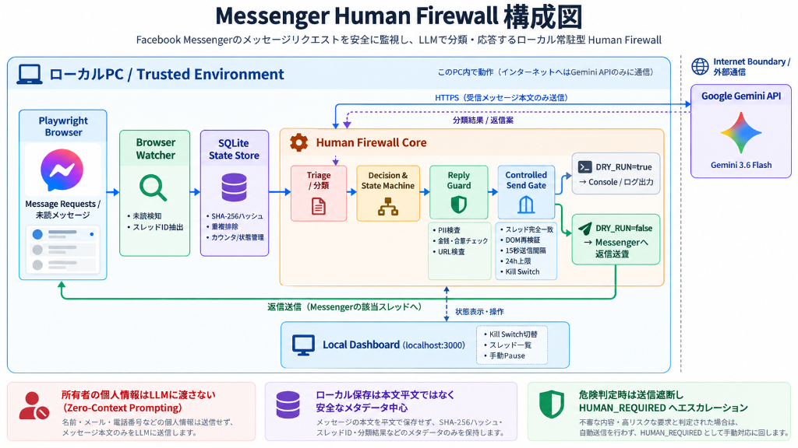

# Architecture & Trust Boundary

## 1. System Topology & Trust Boundary

<p align="center">
  
</p>

```text
┌────────────────────────────────────────────────────────────┐
│ Local Host Machine (Trusted & Controlled Environment)      │
│                                                            │
│  [Playwright Browser]                                      │
│    Messenger Message Requests                              │
│         │                                                  │
│         ▼                                                  │
│  [Browser Watcher & Validator]                             │
│         │                                                  │
│         ├──────────────► [SQLite State Store]              │
│         │                 (sha256 hashes & counters only)  │
│         │                                                  │
│         ▼ (HTTPS: Stranger message text only)              │
│    ═══════════════════════════════════════════════╗        │
│                                                   ║        │
│  [Reply Guard (Safety Regex & Policies)] ◄────────╫────────┼───┐
│         │                                         ║        │   │
│         ▼                                         ║        │   │
│  [Controlled Send Gate]                           ║        │   │
│    (Strict Thread Match, 15s interval, 24h cap)   ║        │   │
│         │                                         ║        │   │
│         ▼                                         ║        │   │
│  [Playwright Dispatch to Active Thread]           ║        │   │
└───────────────────────────────────────────────────╫────────┘   │
                                                    ║             │
                                 Internet Boundary  ║             │
                                                    ▼             │
                                      ┌───────────────────────┐   │
                                      │ Third-Party Cloud     │   │
                                      │ Google Gemini API     │───┘
                                      │ (gemini-3.6-flash)    │
                                      │ Header: x-goog-api-key│
                                      └───────────────────────┘
```

---

## 2. Component Pipeline

1. **Browser Watcher (`src/browser/`)**:
   - Playwright によるローカル常駐監視。
   - `Message Requests` タブを走査し、未読メッセージおよびスレッドIDを抽出。
   - メッセージ本文の SHA-256 ハッシュをローカル SQLite (`src/core/storage.ts`) に照合して重複排除。

2. **Human Firewall AI (`src/llm/gemini.ts`)**:
   - Google Gemini 3.6 Flash によるトリアージ分類（Structured Output）。
   - カテゴリ（`NORMAL`, `SALES`, `SPAM`, `SCAM`, `HARASSMENT`, `UNKNOWN`）およびアクション（`POLITE_REPLY`, `TIME_WASTER`, `IGNORE`, `HUMAN_REQUIRED`, `BLOCK_RECOMMENDED`）を判定。

3. **Decision & State Machine (`src/core/firewall.ts`, `src/core/state-machine.ts`)**:
   - ターン数に応じた対話状態の遷移（`curious` ➜ `deep_probing` ➜ `hesitant_closing`）。
   - スレッド状態管理（`active`, `paused`, `blocked`）。

4. **Reply Guard (`src/core/reply-guard.ts`)**:
   - LLM出力に対するローカル正規表現・ルールベース検査（PII、金銭・契約・合意、URL）。
   - 危険パターン検知時は即座に `REPLY_BLOCKED` とし、人間へエスカレーション。

5. **Controlled Send Gate (`src/core/pipeline.ts`, `src/browser/send-reply.ts`)**:
   - スレッドID完全一致およびクリック後の DOM `.active` 要素再検証。
   - 1スレッド24時間最大20通、1日最大100回LLMリクエスト、15秒送信インターバル、緊急停止（Kill Switch）を強制。
